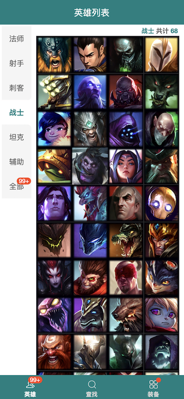
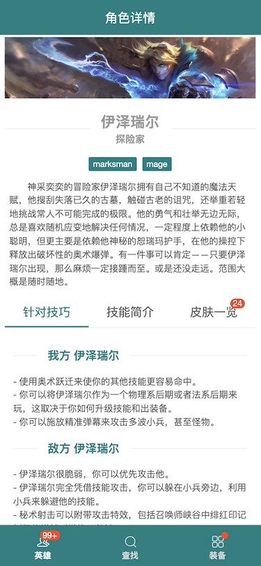
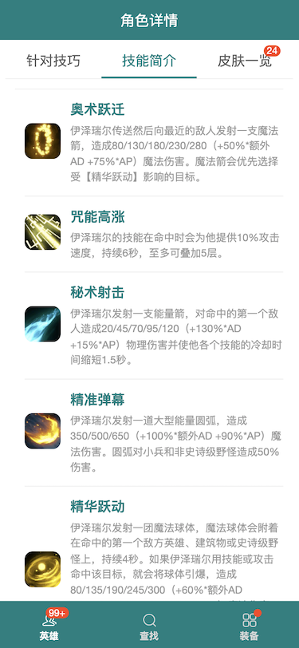
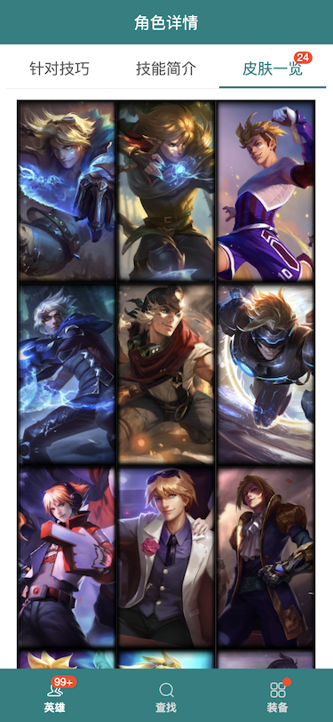
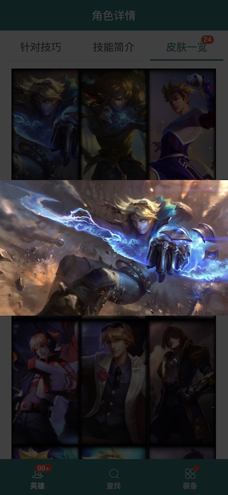
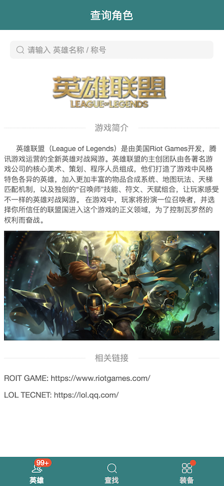

# LOL Characters and Weapons' Detail

## Tech Stack

- [React]()
- [TypeScript]()
- [Create-React-App]()
- [React-Router-Dom]() v6
- [AntDesign]() v4
- [Sass]()
- [Axios]()
- [yarn]()

## Routes

<b>Heroes page</b>

Characters' list, divided into 7 types.

<b>Search page</b>

Only support character's name and nickname

<b>Detail page</b>

Current character's background story description, skills introduction and hero's skins.

<b>Weapons page</b>

developing...

## Images

